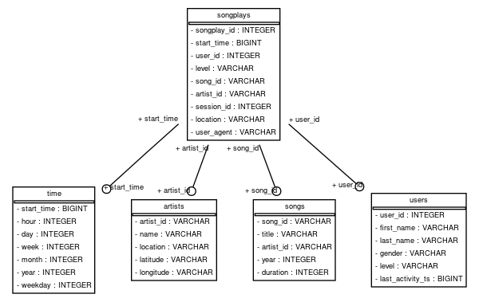

# Sparkify 
------

## Scenario given

A startup called Sparkify wants to analyze the data they have been collecting on songs and user activity on their new music streaming app.
The analytics team is particularly interested in understanding what songs users are listening to. 
Currently, they do not have an easy way to query their data, which resides in a directory of JSON logs on user activity on the app,
 as well as a directory with JSON metadata on the songs in their app.

They'd like a data engineer to create a Postgres database with tables designed to optimize queries on song play analysis, and bring you on the project.
Your role is to create a database schema and ETL pipeline for this analysis.
You will be able to test your database and ETL pipeline by running queries given to you by the analytics team from Sparkify and compare your results with their expected results.

## How to process the dataset

- Create the tables using the script `create_tables.py`
- Import all records using the script `etl.py`

#### Setup the env locally with docker

The file `docker-compose.yml` is available in the root path, that will create two containers (postgres and JupterLab). 

Run the command `docker-compose up` and check the output to get the JupterLab URL.

In the JupterLab environment, open a terminal and run the shell scripts `package.sh` available in the `shell` folder to install all python packages required.

The next step is to run the scripts `create_tables.py` to create all tables and `etl.py` to perform the pipeline.

> :warning: **Both files are set to connect to the database _sparkifydb_ in the host named _postgres_ (a docker container created by the docker-compose.yml). If the environment is not _dockerized_ update these files to point to the correct database host**

#### Files available

Python
- **create_tables.py**: Drop & Create all tables in the sparkifydb
- **etl.py**: Import all files from the dataset into sparkifydb
- **sql_queries.py**: Auxiliary python file with all DML and DDL operations, used by `create_tables.py`, `etl.py`.
- **schema.py**: Auxiliary python script to generate the ER Model as png file. (See section [Generating ER Model](#) for more details)

Notebooks
- **etl.ipynb**: ETL exploration process before build the `etl.py` script
- **test.ipynb**: Query exploration into sparkifydb

Shell scripts
- **package.sh**: Utility script to install all python packages using _pip_

Docker infrastructure 
- **docker-compose.yml**: compose file to create the docker local dev environment
- **docker-entrypoint-initdb.d/init.sh**: progress entrypoint to create the default database and users

## Table Model

The model adopted was a STAR SCHEMA, where we have the fact table `songplay` and the dimensions table `users`, `songs`, `artists`, `time`



### Tables 

#### Dimension table `time`

| Column     | Datatype | Description |
|------------|----------|-------------|
| start_time | bigint   | (Primary Key) value in timestamp
| hour       | int      | Hour in 24h format
| day        | int      | Day of month
| week       | int      | Week number in the year
| month      | int      | Month with January=1, December=12
| year       | int      | Year 
| weekday    | int      | The day of the week with Monday=0, Sunday=6


#### Dimension table `artist`

| Column     | Datatype | Description |
|------------|----------|-------------|
| artist_id  | varchar  | (Primary Key) 
| name       | varchar  | 
| location   | varchar  | 
| latitude   | varchar  | Value in decimal degrees
| longitude  | varchar  | Value in decimal degrees


#### Dimension table `users`

| Column            | Datatype | Description |
|-------------------|----------|-------------|
| user_id           | int      | (Primary Key) 
| first_name        | varchar  | 
| last_name         | varchar  | 
| gender            | varchar  | 
| level             | varchar  | Values `free` or `paid`
| last_activity_ts  | bigint   | Last activity registry in timestamp


#### Dimension table `songs`

| Column     | Datatype | Description |
|------------|----------|-------------|
| song_id    | varchar  | (Primary Key) 
| title      | varchar  | 
| artist_id  | varchar  | 
| year       | int      | 
| duration   | int      |


#### Fact table `songplays`

| Column      | Datatype | Description |
|-------------|----------|-------------|
| songplay_id | serial   | (Primary Key) Auto increment 
| start_time  | bigint   | (Foreign key) table time
| user_id     | int      | (Foreign key) table users
| level       | varchar  | Values `free` or `paid`
| song_id     | varchar  | (Foreign key) table songs
| artist_id   | varchar  | (Foreign key) table artists
| session_id  | int      | 
| location    | varchar  | 
| user_agent  | varchar  | 


## Generating ER Model

To build the database ER model in a png image, the python package was used [sqlalchemy_schemadisplay](https://github.com/fschulze/sqlalchemy_schemadisplay). It requires the OS library https://graphviz.org/.

The following steps will provide a guide how to install and build the ER model image using the local _dockerized_ environment.

1. Init the environment: 

```shell
docker-compose up
```

2. In another terminal, open a bash terminal into the JupterLab container as root: 

```shell
docker exec -it -u root notebook bash
```

3. Run the shell command to install graphviz

```shell
apt update
apt-get install -y graphviz
```

4. Run the python script to create the EM model image

```shell
cd work
sh shell/package.sh
python schema.py
```
> :warning: **The step above must be executed after create all tables**


## Analytics

#### Top 3 most active users on the platform

```sql
SELECT u.first_name, u.last_name, u.level, count(s.user_id) as count 
  FROM songplays s
       JOIN users u
         on s.user_id = u.user_id
GROUP BY u.first_name, u.last_name, u.level
ORDER BY count desc
LIMIT 3;
```

| first_name | last_name | count |
|------------|-----------|------:|
| Chloe      | Cuevas    | 692   |
| Tegan      | Levine    | 665   |
| Kate       | Harrell   | 557   |

#### Top 3 most active users on the platform (last 7 days of records)

```sql
SELECT u.first_name, u.last_name, u.level, count(s.user_id) as count 
  FROM songplays s
       JOIN users u
         on s.user_id = u.user_id
WHERE s.start_time between  ( (select max(start_time) from songplays) - (7 * 24 * 60 * 60 * 1000)) and (select max(start_time) from songplays)\
GROUP BY u.first_name, u.last_name, u.level
ORDER BY count desc
LIMIT 3;
```

| first_name | last_name | count |
|------------|-----------|------:|
| Chloe      | Cuevas    |  334  |
| Tegan      | Levine    |  200  |
| Mohammad   | Rodriguez |  163  |


#### Users `paid` vs `free`